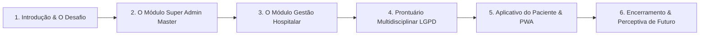

# 🎤 Roteiro de Apresentação Oficial: AXION - Radioterapia Humanizada
> **Apresentador:** Robson Cordeiro  
> **Objetivo:** Apresentar a plataforma AXION para gestores hospitalares, profissionais da saúde e investidores, demonstrando o funcionamento de cada módulo, a conformidade com a LGPD e o impacto na humanização do tratamento oncologico.

---

## 📌 ESTRUTURA GERAL DA APRESENTAÇÃO (Duração estimada: 20 a 30 minutos)



---

## 🎬 BLOCO 1: ABERTURA E O PROPÓSITO DO AXION (3 min)

### 🎙️ Fala do Apresentador:
> *"Boa tarde a todos. Hoje quero apresentar a vocês uma solução que nasceu para resolver uma das maiores dores da oncologia moderna: a desassistência de informação durante a radioterapia.*  
> *O tratamento radioterápico é longo, gera ansiedade no paciente e exige uma coordenação cirúrgica entre Médicos, Enfermeiros e Técnicos. O **AXION** é uma plataforma em nuvem criada para unificar essa jornada com máxima segurança jurídica, alinhada à **LGPD** e aos conselhos éticos de medicina e enfermagem."*

---

## 🏢 BLOCO 2: PAINEL MASTER - SUPER ADMIN (4 min)
*(Acesse a URL secreta `/superadmin` na demonstração)*

```
👑 SUPER ADMIN MASTER
├── 📊 Visão Geral de Hospitais Contratantes
├── 💳 Acompanhamento por Unidade (Cobrança por Paciente Ativo)
└── 🗑️ Gestão de Licenças e Operações de Rede
```

### 🎙️ O que mostrar na tela:
1. **Total de Unidades Conectadas**: Mostre como o gestor principal acompanha em tempo real quantas clínicas e hospitais utilizam o AXION.
2. **Faturamento Transparente por Unidade**: Mostre que o modelo opera por **paciente ativo admitido**, permitindo escala justa para clínicas de todos os portes.
3. **Segurança de Acesso**: Explique que este painel fica isolado em rota própria (`/superadmin`), protegendo os dados estratégicos da plataforma.

---

## 🏢 BLOCO 3: GESTÃO DA UNIDADE HOSPITALAR - ADMIN DO HOSPITAL (5 min)
*(Entre como `luizsampa@gmail.com` / Senha: `123456789`)*

```
🏢 ADMIN DA UNIDADE (Hospital Sampa D'or)
├── 👥 Gestão da Equipe Multidisciplinar (Médico, Enfermeiro, Técnico)
├── 📜 Admissão de Pacientes & Geração de Código Único
└── 🛡️ Conformidade LGPD (Sem acesso ao prontuário médico)
```

### 🎙️ O que mostrar na tela:
1. **Aba Equipe (`👥 Equipe`)**:
   - Mostre como o administrador do hospital cadastra seus profissionais: **Dr. Chico César** (Médico), **Patrícia Mello** (Enfermeira) e **Ricardo Pinto** (Técnico).
   - Destaque o botão **`📋 Copiar Credenciais para WhatsApp`** para envio rápido ao profissional.
2. **Admissão de Paciente (`+ Admitir Paciente`)**:
   - Cadastre um paciente ao vivo (ex: *Roberto de Jesus Vasconcelos*).
   - Mostre a geração do **Código Único AXION** (ex: `AX-NAE-5602`).
3. **Destaque de Segurança LGPD**:
   - *Ressalte para a platéia:* **"Em total conformidade com a LGPD e o sigilo médico, o perfil administrativo não possui acesso ao prontuário clínico nem às evoluções dos pacientes. Sua função é puramente operacional e de faturamento."**

---

## 🏥 BLOCO 4: PRONTUÁRIO MULTIDISCIPLINAR UNIFICADO (RBAC / LGPD) (8 min)
*(Acesse o Painel Clínico como Profissional da Saúde)*

Explique que cada profissional da equipe enxerga um painel **totalmente adaptado à sua responsabilidade legal**:

### 1. ⚛️ O Técnico em Radioterapia (Login: `ricardopinto@gmail.com`):
- **O que faz**: Acessa a **Ficha Técnica de Aplicação da Sessão**.
- **Demonstração**: Registra os dispositivos de imobilização (ex: *Máscara Termoplástica + Colchão Vac-Lok*) e clica em **`✅ Confirmar Execução & Dar Baixa na Sessão #1`**.
- **Resultado**: A baixa faz o progresso do paciente avançar instantaneamente de **`0/30 (0%)`** para **`1/30 (3%)`**.

### 2. 🩺 O Enfermeiro Oncologista (Login: `patriciamello@gmail.com`):
- **O que faz**: Acompanha a toxicidade cutânea e cuida do bem-estar do paciente.
- **Demonstração**: Seleciona a escala de **Radiodermite (Grau 0 a 3)** e digita a **Evolução de Enfermagem** (ex: *Sinais vitais estáveis, orientações para hidratação da pele*).
- **Resultado**: A anotação fica salva no histórico de enfermagem identificada com seu nome e horário.

### 3. 👨‍⚕️ O Médico Oncologista (Login: `chicocesar@gmail.com`):
- **O que faz**: Possui a **Visão Consolidada do Prontuário Multidisciplinar**.
- **Demonstração**: O médico abre o prontuário e visualiza em **uma única linha do tempo**:
  - 📊 *Diário de Sintomas relatado pelo próprio paciente no celular*;
  - 🩺 *Evoluções gravadas pela equipe de enfermagem*;
  - ⚛️ *Histórico de sessões executadas pelo técnico*;
  - 👨‍⚕️ *Campo exclusivo para registro da Conduta Médica e Prescrição*.

---

## 📱 BLOCO 5: A EXPERIÊNCIA DO PACIENTE & TECNOLOGIA PWA (5 min)
*(Acesse como Paciente com o Código Único `AX-NAE-5602`)*

```
🧑 APLICATIVO DO PACIENTE (PWA)
├── 📊 Meu Perfil & Código de Acesso
├── 📅 Calendário de Sessões (1 a 30) com Marcação de Execução
├── 📝 Diário Diário de Sintomas (Fadiga, Dor, Náusea, Sono...)
└── 🤖 Assistente IA Oncologia & Guia de Direitos
```

### 🎙️ O que mostrar na tela:
1. **Aba Perfil**:
   - Mostre a visualização clara da barra de progresso do tratamento (ex: `1/30 sessões - 3% concluído`).
2. **Aba Tratamento (Calendário Interativo)**:
   - Mostre o grid com os cartões numerados das **30 sessões**.
   - Destaque que a **Sessão #1** já aparece marcada como **`✓ Concluída`** com o selo da data da aplicação realizada pelo técnico.
3. **Aba Sintomas (Diário Diário)**:
   - Mostre os sliders interativos de sintomas (Fadiga, Dor, Náusea, Apetite, Ansiedade, Sono).
   - Clique em **`Registrar Sintomas de Hoje`** e mostre que a nota cai imediatamente no histórico do prontuário do médico!
4. **Tecnologia PWA (Progressive Web App)**:
   - *Explique:* **"O AXION pode ser instalado em qualquer Android ou iPhone sem precisar passar pelas burocracias das lojas de aplicativos. Basta clicar em 'Adicionar à Tela de Início' e ele vira um app nativo com ícone próprio e funcionamento offline."**

---

## 🏆 BLOCO 6: CONCLUSÃO E PERGUNTAS (3 min)

### 🎙️ Encerramento Impactante:
> *"Senhores gestores e colegas da saúde, o AXION não é apenas um software de gestão: é uma ponte de empatia e eficiência.*  
> *Ele garante que o hospital fature com precisão, que a equipe médica e de enfermagem trabalhe integrada sob rigorosa conformidade com a LGPD, e que o paciente passe pelo tratamento se sentindo acolhido e seguro a cada sessão.*  
> *Muito obrigado e estou aberto às dúvidas de vocês!"*

---

## 💡 DICAS PRÁTICAS PARA O SEU DIA DE PALESTRA:

> **Checklist para a Demonstração ao Vivo:**
> 1. Tenha as 4 credenciais anotadas em um papel ou slide:
>    - **Admin Hospital:** `luizsampa@gmail.com` / `123456789`
>    - **Médico:** `chicocesar@gmail.com` / `123456789`
>    - **Enfermeira:** `patriciamello@gmail.com` / `123456789`
>    - **Técnico:** `ricardopinto@gmail.com` / `123456789`
> 2. Teste a abertura no seu próprio celular antes da palestra para mostrar o ícone do **PWA instalado na tela de início**.
> 3. Use o link oficial da Vercel: **[https://axion-seis.vercel.app/](https://axion-seis.vercel.app/)**.
